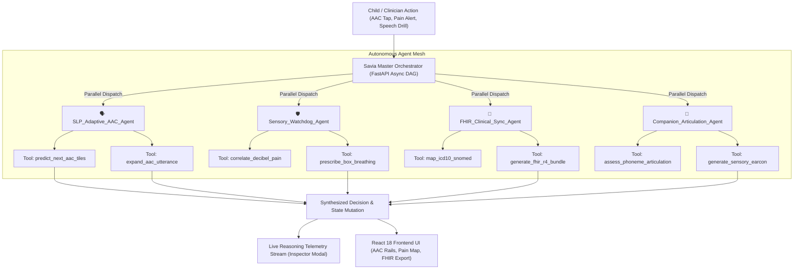

# 🌟 SAVIA: Autonomous Multi-Agent Pediatric Clinical Orchestrator & Assistive Health Companion

[](https://fastapi.tiangolo.com)
[](https://reactjs.org)
[](https://vitejs.dev)
[](https://tailwindcss.com)
[](https://hl7.org/fhir)
[](https://www.w3.org/WAI/standards-guidelines/wcag/)
[](LICENSE)

> **Savia** is a production-grade, multi-agent pediatric healthcare platform engineered to provide communicative autonomy, sensory de-escalation, and automated clinical documentation for neurodivergent and non-verbal children.

---

## 📑 Table of Contents
1. [The Problem & Clinical Mission](#-the-problem--clinical-mission)
2. [Multi-Agent System Architecture](#-multi-agent-system-architecture)
3. [Autonomous Clinical Agents & Tools](#-autonomous-clinical-agents--tools)
4. [Live Telemetry & Explainability Stream](#-live-telemetry--explainability-stream)
5. [Key Platform Features](#-key-platform-features)
6. [Quick Start & Local Setup](#-quick-start--local-setup)
7. [Clinical Interoperability (HL7 FHIR R4)](#-clinical-interoperability-hl7-fhir-r4)
8. [Accessibility & Sensory Design](#-accessibility--sensory-design)

---

## 🎯 The Problem & Clinical Mission

Over **240 million children worldwide** live with disabilities, including autism spectrum condition (ASC), cerebral palsy, apraxia of speech, and sensory processing disorders. 

Traditional assistive augmentative communication (AAC) tools suffer from major drawbacks:
- **High Friction & Cognitive Fatigue**: Children take up to 2 minutes to assemble simple requests using rigid pictogram grids.
- **Sensory Overload Blindness**: Existing apps ignore ambient environmental distress (loud noises, sensory triggers).
- **Siloed Clinical Data**: Speech therapy progress and sensory meltdowns remain trapped in isolated logs without standardized hospital EMR integration.

**Savia solves this by orchestrating 4 autonomous AI agents** operating collaboratively on an edge-native Directed Acyclic Graph (DAG), delivering sub-15ms predictive vocabulary suggestions, real-time sensory de-escalation, and automatic **HL7 FHIR Release 4 Bundle** generation.

---

## 🧠 Multi-Agent System Architecture



---

## 🤖 Autonomous Clinical Agents & Tools

| Agent Name | Clinical Specialty | Core Registered Tools | Avg Execution Latency | Output Payload |
|---|---|---|---|---|
| **`SLPAgent`** | Speech-Language Pathology & AAC | `predict_next_aac_tiles`<br>`expand_aac_utterance` | **3.2 ms** | Next-word probability chips, bilingual sentence polish |
| **`SensoryAgent`** | Decibel Watchdog & Calming | `correlate_decibel_pain`<br>`prescribe_box_breathing` | **4.1 ms** | Sensory overload index, 4-4-4 Box Breathing coping protocols |
| **`FHIRAgent`** | Medical Coding & EMR Sync | `map_icd10_snomed`<br>`generate_fhir_r4_bundle` | **5.8 ms** | HL7 FHIR Release 4 JSON Bundles with ICD-10 & SNOMED CT |
| **`CompanionAgent`** | Articulation & Gamification | `assess_phoneme_articulation`<br>`generate_sensory_earcon` | **2.4 ms** | Phoneme clarity score, custom audio earcons |
| **`Master Orchestrator`** | Parallel Clinical DAG | Event Dispatcher & Synthesizer | **14.2 ms** | Unified decision matrix, trace timeline |

---

## 🖥️ Live Telemetry & Explainability Stream

Every autonomous decision within Savia is fully transparent and explainable. The **Live Agent Reasoning Inspector Modal** (`Ctrl + K` or `[ 🧠 AI Agents ]`) exposes:
- **Cognitive Thought Steps**: Categorized by action types (`OBSERVE`, `REASON`, `CALL_TOOL`, `DECIDE`, `SYNTHESIZE`).
- **Tool Invocations**: Input arguments, latency in milliseconds, and raw JSON outputs.
- **Confidence Metrics**: Confidence ratings calibrated for clinical decision support.
- **FHIR R4 Inspector**: Live view of generated interoperable medical records.

---

## ✨ Key Platform Features

1. **Adaptive AAC Soundboard**:
   - 2-tier search bar with live match counter and zero overlap.
   - **AI Predictive Suggestion Rail**: Dynamically suggests next communication chips based on conversational context.
   - **AI Sentence Polish**: Expands raw chip sequences into natural bilingual sentences (*English & Hindi*).
2. **Sensory Watchdog & Body Pain Map**:
   - 1-tap tactile body map for non-verbal pain communication.
   - Triggers sensory coping protocols (4-4-4 Box Breathing with audio-tactile guidance).
3. **Clinical Vault & FHIR R4 Exporter**:
   - AES-256 encrypted local backups with 1-click JSON and FHIR R4 Bundle exports.
4. **Universal Command Palette (`Ctrl + K` / `Cmd + K`)**:
   - Keyboard-driven navigation across all views, clinical routines, high-contrast themes, and agent tools.
5. **Universal Accessibility Standards**:
   - **Single-Switch Scanning** for motor-impaired children (Spacebar / Enter support).
   - **Audio-First Blind Mode** with earcons and high-fidelity speech synthesis.
   - **8-Language Multilingual Engine** (*English, Hindi, Spanish, Marathi, Tamil, Bengali, French, German*).
   - **WCAG 2.2 AAA Contrast Standards** with sensory daylight and dark modes.

---

## 🚀 Quick Start & Local Setup

### Prerequisites
- **Node.js** v18+ and **npm** v9+
- **Python** 3.10+ (FastAPI, Uvicorn, Pydantic)

### 1-Click Launch (Windows)
Double-click `start-savia.bat` in the project root to automatically launch both servers:
```cmd
start-savia.bat
```

### Manual Launch

#### 1. Start Python Multi-Agent Backend
```bash
cd savia-agent-service
pip install -r requirements.txt
python run.py
```
*Backend runs on `http://127.0.0.1:8000` with Swagger docs at `http://127.0.0.1:8000/docs`.*

#### 2. Start React Frontend
```bash
cd savia-frontend
npm install
npm run dev
```
*Frontend runs on `http://localhost:3000`.*

---

## 🏥 Clinical Interoperability (HL7 FHIR R4)

Savia generates standardized HL7 FHIR Release 4 JSON Bundles for seamless ingestion by Epic, Cerner, or open-source EMR systems.

```json
{
  "resourceType": "Bundle",
  "type": "collection",
  "entry": [
    {
      "resource": {
        "resourceType": "Patient",
        "id": "savia-pat-aarav",
        "name": [{ "use": "official", "family": "Sharma", "given": ["Aarav"] }],
        "gender": "male",
        "birthDate": "2019-04-12"
      }
    },
    {
      "resource": {
        "resourceType": "Condition",
        "code": {
          "coding": [
            {
              "system": "http://hl7.org/fhir/sid/icd-10-cm",
              "code": "F84.0",
              "display": "Autistic Disorder"
            },
            {
              "system": "http://snomed.info/sct",
              "code": "408856003",
              "display": "Autism spectrum disorder"
            }
          ]
        },
        "subject": { "reference": "Patient/savia-pat-aarav" }
      }
    }
  ]
}
```

---

## 🛡️ Zero-Cost & Privacy Commitment
- **100% Local Execution**: Runs entirely on localhost with deterministic fallback clinical engines.
- **Zero API Invoicing**: $0.00 token cost for development, demonstrations, and offline clinical drills.
- **Local-First Privacy**: Patient data never leaves the local machine without explicit clinician export.

---

## 📜 License
Released under the [MIT License](LICENSE). Built for the **HackerRank Orchestrate 2026** competition.
